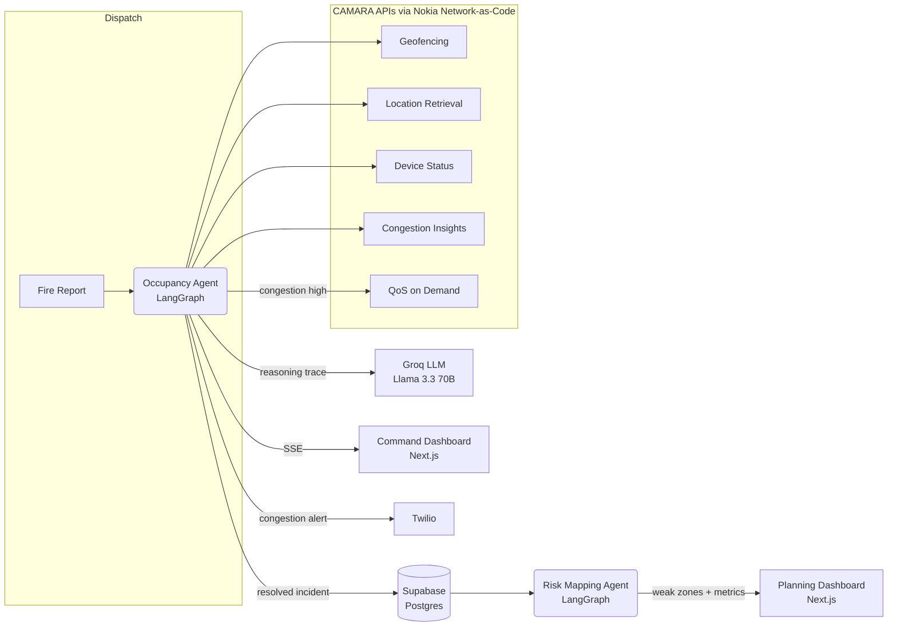

# LifeSignal

**AI agent for real-time fire-scene occupancy detection & network-resilience mapping.**

> Knowing who's still inside — the moment it matters most.

Built for **MENA IGNITE Hackathon — Theme 2: Smart Cities, Urban Safety & Mega-Project
Infrastructure** (GSMA pillar: *Connectivity for Good*).

Team: Fatima Darraj (Lead) · Raghad Altairi · Eman Alasaadi · Marwa Wanas

---

## The problem

When a fire crew arrives on scene, the single most important unknown is human: how many
people are still inside, and where. Today that number comes from shouted estimates,
out-of-date building registries, or nothing at all — so commanders either under-commit
search-and-rescue resources (costing lives) or over-commit them (delaying the next
incident). Separately, civil-defense agencies have no systematic way to identify which
neighborhoods combine high fire risk with weak mobile network coverage — exactly the
areas hardest to reach digitally during an emergency.

## The solution

LifeSignal is an AI agent that plugs into a civil-defense dispatch system. The moment a
fire is reported, it autonomously draws a geofence around the incident, reads live
network signals for devices inside it, and gives the incident commander a
continuously-updating occupant count as people evacuate — **with zero app install
required from residents.** If the network is congested, it automatically requests a
Quality-on-Demand boost so responder communications stay reliable. A companion **Risk
Mapping Agent** aggregates incident history into recurring high-fire, weak-coverage
"weak zones" for civil-defense infrastructure planning.

## What's in this repo

This is the working, end-to-end implementation of the pitch: two AI agents built on
[LangGraph](https://github.com/langchain-ai/langgraph), a FastAPI service exposing them
over REST + Server-Sent Events, and a Next.js command-center UI.

| | |
|---|---|
| **Occupancy Agent** | Geofences an incident, polls CAMARA network signals every tick, estimates occupancy, requests a QoS boost on congestion, and narrates a live reasoning trace via an LLM — looping until the zone reads empty. |
| **Risk Mapping Agent** | Buckets resolved-incident history into a coarse geo-grid and scores each cell on incident frequency + average congestion, surfacing "weak zones" for infrastructure investment. |
| **Command Dashboard** | Live map, occupant counter, network/QoS status, and the agent's reasoning trace, updating in real time over SSE. |
| **Planning Dashboard** | Weak-zone risk map, impact metrics, and a manual recompute trigger for civil-defense planners. |

Every external integration — CAMARA/Nokia Network-as-Code, Groq, Supabase, Twilio — is
**optional**. Without any credentials configured, the whole system runs on deterministic
simulated network signals and a templated reasoning generator, exactly per the pitch's
"graceful degradation" design goal: *cached/simulator responses ensure the live demo
never fails on an API timeout.*

## Architecture



## Tech stack

| Component | Choice | Why |
|---|---|---|
| Agent orchestration | **LangGraph** | Keeps the occupancy estimate stateful across a multi-minute incident lifecycle rather than a single snapshot. |
| LLM | **Groq (Llama 3.3 70B)** | Low-latency free tier keeps the live reasoning trace responsive. |
| Backend | **FastAPI** + SSE | Small, typed REST surface; Server-Sent Events for the live dashboard feed. |
| Frontend | **Next.js 16** on Vercel | Command-center dashboard with a live map and occupancy counter. |
| Memory / data | **Supabase** (Postgres) | Durable incident history for the Risk Mapping Agent. |
| Alerting | **Twilio** | SMS to the command center when a QoS boost is requested. |
| Data source APIs | **CAMARA APIs** via **Nokia Network-as-Code** | Geofencing, Location Retrieval, Device Status, Congestion Insights, QoS on Demand. |

Every component runs on a free or freemium tier — the full prototype can be built,
demoed, and iterated on with zero paid commitment, and every client above degrades to a
local simulator or no-op when its credentials are absent (see `agent/app/config.py`).

## CAMARA APIs used

| API | How LifeSignal uses it | Client |
|---|---|---|
| Geofencing | Defines the incident zone and detects evacuation in real time | `agent/app/camara/geofencing.py` |
| Location Retrieval | Pinpoints devices within the geofenced incident area | `agent/app/camara/location.py` |
| Device Status | Confirms which devices are genuinely reachable, filtering stale signals | `agent/app/camara/device_status.py` |
| Congestion Insights | Detects network strain during the emergency | `agent/app/camara/congestion.py` |
| QoS on Demand | Guarantees responder comms stay reliable | `agent/app/camara/qos.py` |

## Repo structure

```
LifeSignal/
├── agent/                  FastAPI + LangGraph backend
│   ├── app/
│   │   ├── camara/         CAMARA API clients (simulate/live)
│   │   ├── llm/            Groq client + offline fallback
│   │   ├── db/             Supabase client + in-memory fallback
│   │   ├── alerting/       Twilio client + log fallback
│   │   ├── graphs/         Occupancy Agent, Risk Mapping Agent
│   │   ├── routers/        /incidents, /risk-zones, /metrics
│   │   ├── simulator.py    Deterministic network-signal simulator
│   │   ├── seed.py         Synthetic incident history for a fresh install
│   │   └── main.py
│   ├── supabase/schema.sql
│   ├── tests/               pytest suite
│   └── requirements.txt
├── web/                    Next.js dashboard (Command + Planning)
│   ├── app/                 App Router pages
│   ├── components/
│   └── lib/                 API client, SSE hook, types
└── docker-compose.yml
```

## Running it

### Quickest path (Docker)

```bash
docker compose up --build
```

- Agent API: http://localhost:8000 (docs at `/docs`)
- Dashboard: http://localhost:3000

### Local dev

**Backend**

```bash
cd agent
python3 -m venv .venv && source .venv/bin/activate
pip install -r requirements.txt
cp .env.example .env   # optional — see below
uvicorn app.main:app --reload
```

**Frontend** (in a second terminal)

```bash
cd web
npm install
cp .env.example .env.local   # optional, defaults to http://localhost:8000
npm run dev
```

Open http://localhost:3000, click a **Report a Fire** preset, and watch the occupant
count, congestion, and reasoning trace update live. Visit **Planning Dashboard** for the
weak-zone risk map (seeded with synthetic Dubai-area incident history on first run).

### Enabling live integrations (optional)

Copy `agent/.env.example` to `agent/.env` and fill in any subset of:

- `NOKIA_NAC_API_KEY` + `CAMARA_MODE=live` — call the real Nokia Network-as-Code sandbox
  instead of the simulator.
- `GROQ_API_KEY` — real LLM-generated reasoning trace instead of the templated fallback.
- `SUPABASE_URL` / `SUPABASE_KEY` — durable incident history (apply
  `agent/supabase/schema.sql` first).
- `TWILIO_*` — real SMS alerts instead of log lines.

Every integration is checked independently at startup; `GET /health` reports which mode
each is running in.

## Testing

```bash
cd agent && python3 -m pytest -q
```

Covers the network-signal simulator (monotonic evacuation, bounded congestion,
determinism), the Occupancy Agent graph end-to-end (resolves, reaches zero occupants,
requests QoS under congestion), and the API layer (incident lifecycle, risk zones,
metrics, 404 handling).

```bash
cd web && npm run lint && npm run build
```

## Impact metrics (`GET /metrics`)

Mirrors the pitch deck's target metrics, computed live from resolved incidents and the
Risk Mapping Agent: time-to-occupancy-estimate vs. manual methods, high-risk zones
identified, QoS-boost success rate, and estimated resource-misallocation reduction.
Occupant-count accuracy needs post-incident reconciliation with fire-crew headcounts,
which this prototype doesn't have access to — that field is a placeholder mirroring the
pitch's target metric shape, clearly noted in `agent/app/routers/metrics.py`.

## Roadmap beyond the hackathon

- Replace the in-memory SSE bus with Supabase Realtime so the dashboard scales across
  multiple agent instances.
- Wire the Occupancy Agent to a real civil-defense dispatch webhook instead of the
  dashboard's "Report a Fire" presets.
- Post-incident occupant-count reconciliation workflow against fire-crew headcounts, to
  replace the placeholder accuracy metric with a measured one.
- Building-registry integration as a secondary signal alongside network-derived
  occupancy.
